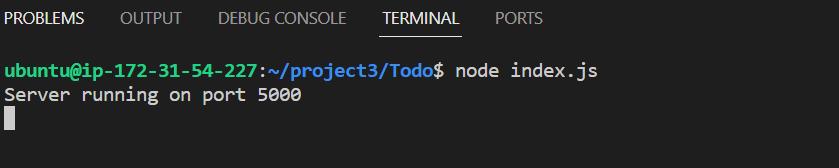
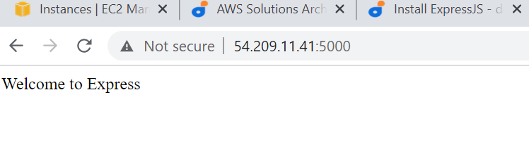

##  STEP 1 – BACKEND CONFIGURATION

**Ubuntu update** 

              $  sudo apt update
              $  sudo apt upgrade

**Install nodejs in server**

      $ curl -fsSL https://deb.nodesource.com/setup_18.x | sudo -E bash -
     $ sudo apt-get install -y nodejs

Confirm the version

         $   node -v 
         $  npm -v

  **Application Code Setup**

  Make directory Todo and cd into it

       $  mkdir Todo
       $  cd Todo

 To initialise your project, so that a new file named package.json will be created. Confirm package was created 

            $   npm init
            $    ls

  **Install ExpressJS**

         $   npm install express
         $    touch index.js

Install the dotenv module
        
         $   npm install dotenv
         $   vim index.js
Copy, paste and save the following codes and quit

const express = require('express');
require('dotenv').config();

const app = express();

const port = process.env.PORT || 5000;

app.use((req, res, next) => {
res.header("Access-Control-Allow-Origin", "\*");
res.header("Access-Control-Allow-Headers", "Origin, X-Requested-With, Content-Type, Accept");
next();
});

app.use((req, res, next) => {
res.send('Welcome to Express');
});

app.listen(port, () => {
console.log(`Server running on port ${port}`)
});

Open the server with this command

    $  node index.js

Open TCP port 5000 and access server from the browser using the remote server IP address

http://<54.82.225.213>:5000

output 

**Routes**

      mkdir routes
      cd routes
      touch api.js
      vim api.js

const express = require ('express');
const router = express.Router();

router.get('/todos', (req, res, next) => {

});

router.post('/todos', (req, res, next) => {

});

router.delete('/todos/:id', (req, res, next) => {

})

module.exports = router;

**MODELS**

mkdir models && cd models && touch todo.js

vim  into  todo.js file  and apaste the codes below

const mongoose = require('mongoose');
const Schema = mongoose.Schema;

//create schema for todo
const TodoSchema = new Schema({
action: {
type: String,
required: [true, 'The todo text field is required']
}
})

//create model for todo
const Todo = mongoose.model('todo', TodoSchema);

module.exports = Todo;

In Routes directory, open api.js with vim api.js, delete the code inside with :%d command and paste there code below into it then save and exit

const express = require ('express');
const router = express.Router();
const Todo = require('../models/todo');

router.get('/todos', (req, res, next) => {

//this will return all the data, exposing only the id and action field to the client
Todo.find({}, 'action')
.then(data => res.json(data))
.catch(next)
});

router.post('/todos', (req, res, next) => {
if(req.body.action){
Todo.create(req.body)
.then(data => res.json(data))
.catch(next)
}else {
res.json({
error: "The input field is empty"
})
}
});

router.delete('/todos/:id', (req, res, next) => {
Todo.findOneAndDelete({"_id": req.params.id})
.then(data => res.json(data))
.catch(next)
})

module.exports = router;

  **MongoDB Database**

         touch .env
         vi .env

